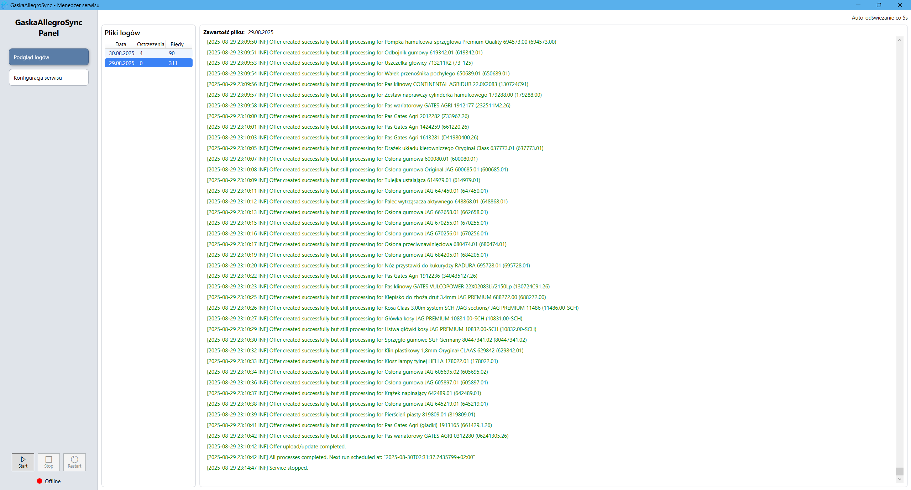
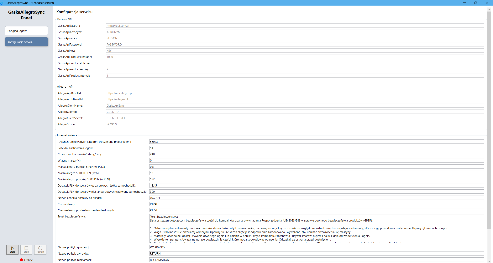

# JSAGROSyncServices

> Commercial project — built for a client, published here as a portfolio sample.

A set of Windows worker services that keep a product catalog and its orders in sync between supplier APIs
and marketplace platforms, plus a WPF application for configuring and monitoring them.

Eight services cover two marketplace accounts across product and order flows. They share one pipeline and
one data layer, so a service is little more than a declaration of *who it is* and *which steps it runs*.

## Architecture

```
Program.cs ──► ServiceContext   (account + supplier)
           └─► SyncPipeline     (which steps this service runs)
                    │
                    ▼
       ProductsServiceHost ──► Worker ──► pipeline steps
                                            ├── supplier client   (Gąska / Rolmar / Inter Cars)
                                            ├── IOfferFactory     (per-supplier offer building)
                                            └── shared services   (offers, products, images, parameters)
```

The pipeline, repositories and marketplace clients are shared. Everything that genuinely differs between
suppliers — pricing rules, offer naming, description layout — sits behind `IOfferFactory`, which keeps the
differences in one readable place instead of spread across eight near-identical services.

## Projects

| Project | Role |
| --- | --- |
| `Allegro.JSAGRO*.{Gaska,Rolmar,InterCars}.ProductsService` | Product and offer synchronization, one service per account × supplier |
| `Allegro.JSAGRO*.Gaska.OrdersService` | Order import and supplier order placement |
| `Allegro.JSAGRO.Erli.ProductsService` | Offer replication to a secondary marketplace |
| `JSAGROSyncServices.Products` | Shared product pipeline: worker, repositories, marketplace and supplier services |
| `JSAGROSyncServices.Orders` | Shared order pipeline |
| `JSAGROSyncServices.Infrastructure` | Data access, HTTP clients, retry policy, logging, SQL migrations |
| `JSAGROSyncServices.Contracts` | DTOs, models, settings and interfaces shared across projects |
| `JSAGROSyncServices.Tests` | Unit tests for the rules worth protecting |
| `ServiceManager` | WPF configurator and log viewer |

## Engineering notes

A few decisions that shaped the code more than the feature list did.

**One pipeline, many services.** Each service declares a `ServiceContext` and a `SyncPipeline` and inherits the
rest. Adding an integration means writing an `IOfferFactory` and a supplier client, not another copy of the
worker.

**Catalog matching needs a second opinion.** Matching a product to a marketplace catalog entry by catalog
number alone is unsafe: a digits-only number collides across unrelated categories. A numeric match is only
accepted when the brand or the product name agrees as well.

**Shipping price lists are matched by fit, not by name.** Dimensions are parsed from free-form supplier
specifications, normalized to centimetres, and tested against each price list with axis-aligned rotation, so a
parcel that only fits sideways still fits.

**Rate limits are a design input.** All marketplace and supplier calls go through one retry policy that honours
`Retry-After` in both header formats; request concurrency is configurable per account, because the throttling
that actually bites is per-user concurrency rather than the documented per-minute quota.

**Migrations run on startup, once.** DbUp applies each script in its own transaction behind `sp_getapplock`, so
several services starting at the same time cannot race each other through the same schema change.

**Tests cover the expensive mistakes.** Dimension parsing, price-list fitting, price build-up, retry behaviour
and catalog matching are unit tested — the rules where a silent error reaches live listings and costs money.

## Screenshots

### Configurator — log view



### Configurator — settings



## Built with

- **.NET 10** worker services, **.NET 10 WPF** desktop app, C#
- **SQL Server** with **Dapper** and **DbUp** migrations
- **Serilog** structured logging
- **xUnit** for tests
- REST integrations with marketplace and supplier APIs (OAuth2, CSV/ZIP data exchange)

## License

This project is licensed under the [MIT License](LICENSE).

---

© 2025-present [calKU0](https://github.com/calKU0)
